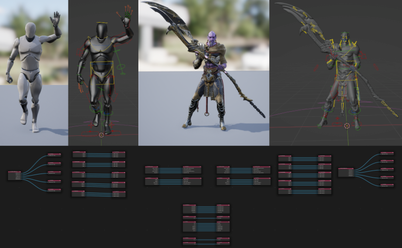

  

<h1 align="center">Blender Tools</h1>
  

A repository of blender addons that improve the game development workflow between Blender and Unreal Engine.

### NOTE: This is a fork of the original [repository by Epic](https://github.com/EpicGamesExt/BlenderTools). 
This is now maintained by [@JoshQuake](https://github.com/JoshQuake) and volunteers from the community and is not affiliated with Epic Games. 

## Send to Unreal

A one-click solution for sending assets from Blender to Unreal Engine.

* [Read Docs](https://poly-hammer.github.io/BlenderTools/send2ue/)
* [Download Addon](https://github.com/poly-hammer/BlenderTools/releases?q=Send+to+Unreal&expanded=true)

## UE to Rigify

A node based retargeting system for Blender's
[Rigify](https://docs.blender.org/manual/en/latest/addons/rigging/rigify/index.html) addon. Quickly retarget and author
new animation on unreal marketplace assets and more!

* [Read Docs](https://poly-hammer.github.io/BlenderTools/ue2rigify/)
* [Download Addon](https://github.com/poly-hammer/BlenderTools/releases?q=UE+to+Rigify&expanded=true)

## Help Contribute
Contributions are encouraged! Find out how you can contribute to this repo in one of the following ways:

* [Help Develop](https://poly-hammer.github.io/BlenderTools/contributing/development.html)
* [Help Document](https://poly-hammer.github.io/BlenderTools/contributing/documentation.html)
* [Help Test](https://poly-hammer.github.io/BlenderTools/contributing/testing.html)

## Get Notified on a New Release
Never miss a new addon release! Do this:
1. At the top right of this page select `Watch`
1. Select `Custom` from the dropdown.
1. Check `Releases`
1. Click `Apply`.

You will now get an email notification everytime there is a new version of an addon released.

