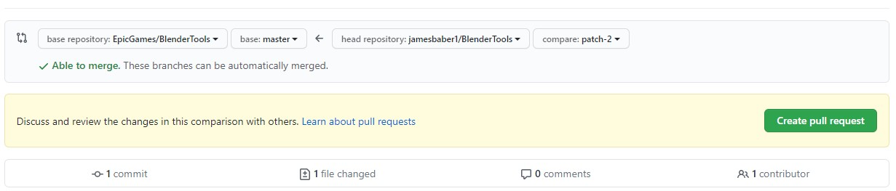

# Help Document
Having accurate and up to date documentation is important, so that is why we have made it easy to submit changes to our documentation. All the documentation pages are written in markdown, but html tags are supported.

## Editing a Page
To edit an existing page, click the link "Help us improve this page!" in the footer of the page you want to edit.


You will then be prompted to make your own fork of the repository. Click 'Fork this repository'.


Edit the markdown file and click 'Propose changes'.


Then create a pull request.



After your pull request is merged in a new deployment of the site will be made.

## Testing Locally
The documentation sites are static html sites that are generated using [mkdocs](https://www.mkdocs.org/). To get the docs working locally run these commands:

``` shell
pip install -r requirements.txt
mkdocs serve
```

The site should now be available to preview at:

[http://localhost:8080/](http://localhost:8000/)


# Building
The can be built into a single static html site by running:
```shell
mkdocs build
```

They are built and deployed using this [workflow](https://github.com/poly-hammer/BlenderTools/.github/workflows/docs.yml)
