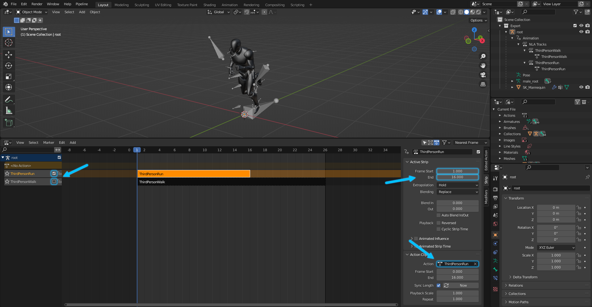
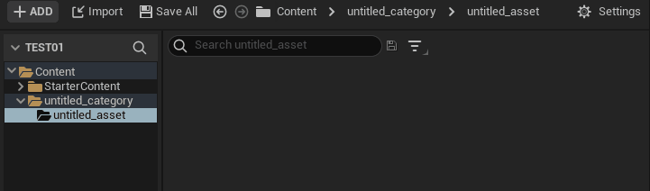
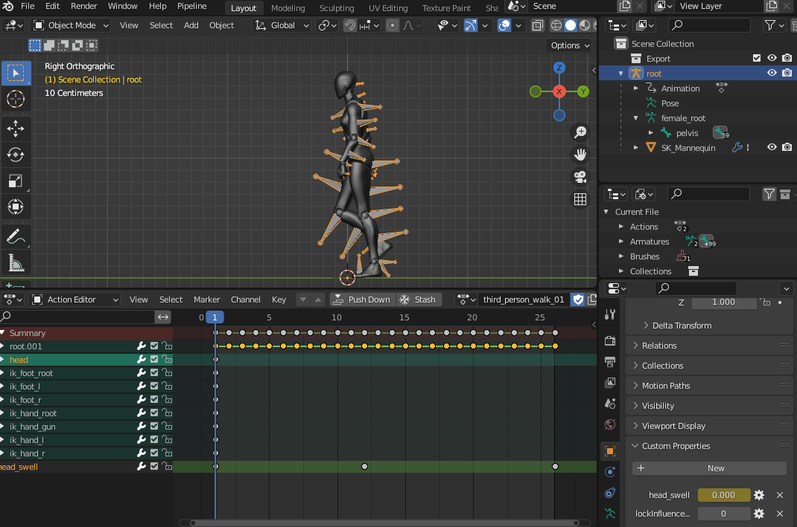
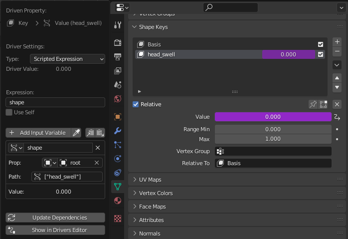
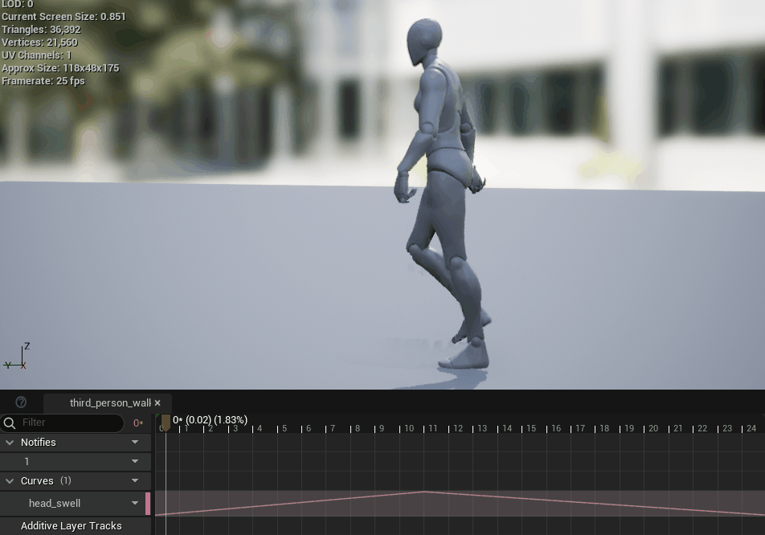

# Animation Sequence

When creating Animation, Send to Unreal looks for [action strips](https://docs.blender.org/manual/en/latest/editors/nla/strips.html#action-strips) in the Blender NLA Editor.

The NLA Editor is used to determine several things:
1. Which actions belong to an armature object.
!!! note 

      Actions in blender all exist in the same data block namespace and just contain fcurves values.
      It is not until they are set in an object's animation data that a determination can be made that an action belongs to a particular object.
      This is different from how unreal AnimSequence assets work. Unreal AnimSequence assets must have an associated skeletal mesh in order to exist. Therefore,
      Send to Unreal only exports skeletal mesh animation if the armature object has action strips in its NLA tracks. Also read about the [auto stash active action](https://poly-hammer.github.io/BlenderTools/send2ue/settings/export.html#auto-stash-active-action) option.

2. Which action to export, by checking which NLA tracks are not muted.
!!! note 

      All un-muted strips in the NLA Editor will be sent as an AnimSequence of the skeleton
      that is in the `Export` collection. Also read about the [Export All Actions](https://poly-hammer.github.io/BlenderTools/send2ue/settings/export.html#export-all-actions) option.

3. The start and end of the Unreal Animation, by using the start and end frame of the clip.
!!! note 

      The first frame of the clip is the first frame of the AnimSequence and the end of the
      animation will be relative to the start.

4. The name of an unreal AnimSequence asset will match the name of its action in blender.

## Skeletal Mesh with Animation
The animation can be imported along with entire skeletal mesh.

In this case you can see the Skeletal Mesh, Skeleton, Physics Asset, and Animation are
all sent in a single operation.

## Only Animation
What if the skeleton and skeletal mesh already exist in your project, and you just want to
import animation onto an existing skeleton? That can be done in two ways: (1) by turning off all
import options in the [import settings](/settings/import.html) except for Animations;
(2) or by placing only the armature object in the `Export` collection. Both ways require you to set the project path
to the Skeleton asset under the [Paths](https://poly-hammer.github.io/BlenderTools/send2ue/settings/paths.html#skeleton-asset-unreal)
tab in the settings dialog.

!!! note 

      An easy way to do this is to right-click the unreal Skeleton asset and click "Copy Reference".

In this case two strips were un-muted, therefore two animations were imported onto the referenced skeleton asset.
!!! note 
      
      Also if [export all actions](https://poly-hammer.github.io/BlenderTools/send2ue/settings/export.html#export-all-actions) was on, all actions would be exported regardless of their mute values.

## Morph Targets

Here is an example of how to send shape key animation in blender to unreal as an animated morph target.

!!! note 
   
      The [export custom property fcurves](https://poly-hammer.github.io/BlenderTools/send2ue/settings/export.html#export-custom-property-fcurves) must be set to true in
      order for this to work. Also note that this can apply to any custom property fcurves not just the morph targets fcurve.

In this example a driver is created so that a custom float property `head_swell` on the armature object drives a shape key
value. Furthermore, that custom property value is keyed in the `third_person_walk01` action.

!!! note 

      Both the custom property and the driven shape key must have the same exact name in order for unreal to recognize it!

!!! note 

      This is what the driver settings look like:
      

Also note that on the Import tab under the FBX import settings `Import Morph Targets` must be set to true.
After moving the mannequin mesh and armature into the `Export` collection and running the send to unreal operation,
the animation should import with the animated morph target value in the `third_person_walk01` animation.

