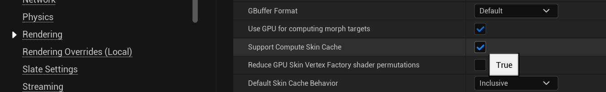
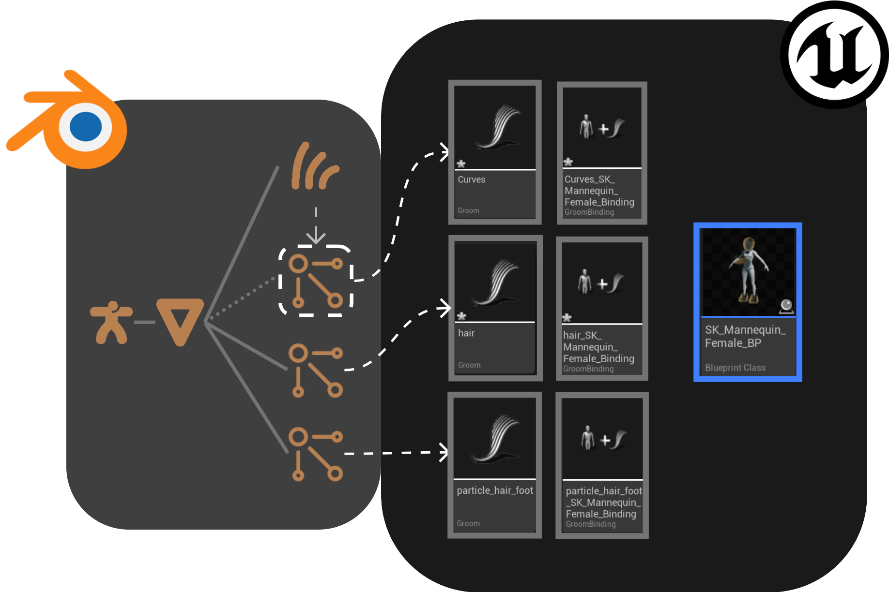
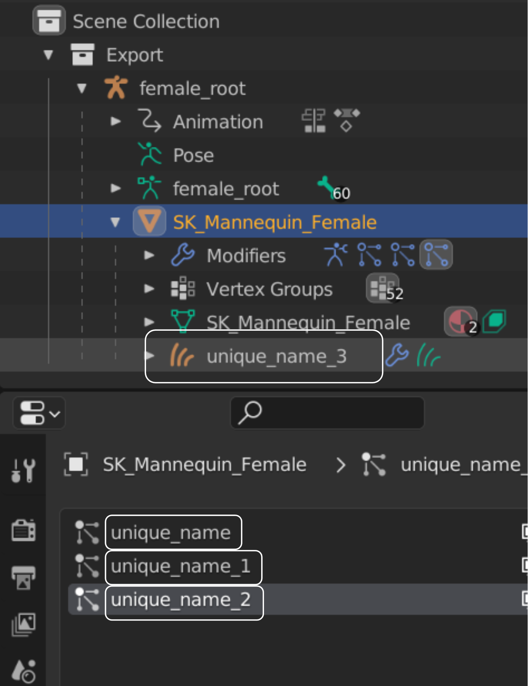

# Groom

!!! warning 

    Required UE Plugins. Make sure to have the unreal plugins "Alembic Groom Importer" and "Groom" enabled for the addon to work properly.
    

!!! warning 

    Required UE Project Setting. Make sure to have the setting "Support Compute Skin Cache" turned on in Project Settings > Engine > Rendering > Optimizations for grooms to render properly when bound to a skeletal mesh. 

The tool infers an Unreal groom asset based strictly on the content of your `Export` collection. By default, each
particle system of type 'Hair' on each mesh in the collection is exported as an individual alembic file, which is
imported to unreal as a groom asset.

!!! tip

    To gain more control over how particle systems are exported, use the [_combine assets_](https://poly-hammer.github.io/BlenderTools/send2ue/extensions/combine-assets.html)
    extension that has options such as _combine groom for each mesh_ and more.

!!! warning

    Please give each particle system and curves object a unique name across all meshes. While Blender lets particles on
    different meshes share the same name, the addon requires each name to be unique to prevent assets getting overwritten
    in Unreal. This is because multiple groom assets can be imported into the same directory in unreal, and any
    asset with duplicate names will get overwritten.

    {: style="width:200px"}

## Curves Objects

The Curves object type was introduced in [Blender 3.3](https://www.blender.org/download/releases/3-3/), enabling a revamped hair sculpting workflow. The send2ue addon
supports the export of a curves object into a groom asset in unreal. Under the hood, the addon temporarily converts
the curves object into a hair particle system on the mesh that it’s surfaced to, which would then be exported as an alembic file.

## Only Groom

By default, the groom asset will import along with the mesh asset that it is surfaced to. To run a strictly groom asset
import (meaning no other asset types will be exported from blender and imported to unreal), all import options (mesh,
animation, textures) must be turned off in your [import settings](https://poly-hammer.github.io/BlenderTools/send2ue/settings/import.html) except for `Groom`. Alternatively,
the blender `Curves` objects can be placed in the `Export` collection (without their surface mesh objects) which
denotes an exclusive groom workflow as well.

## Binding Assets and More

The addon provides an extension called [create post import assets for groom](https://poly-hammer.github.io/BlenderTools/send2ue/extensions/create-post-import-groom-assets.html)
to automatically create unreal assets (such as a binding asset) for the imported groom asset. See the extensions section
for more information on its usage.
