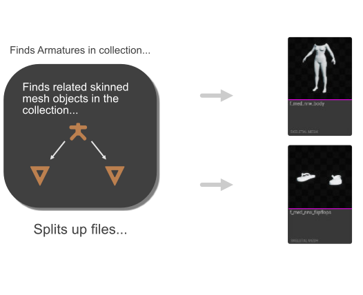
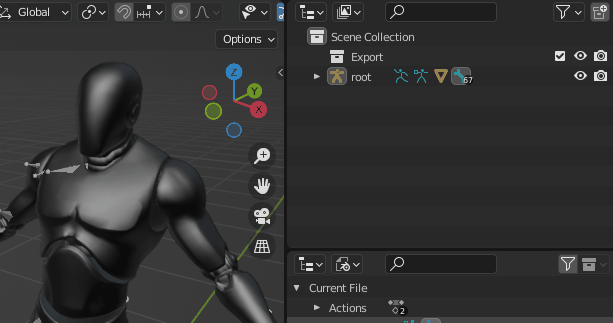
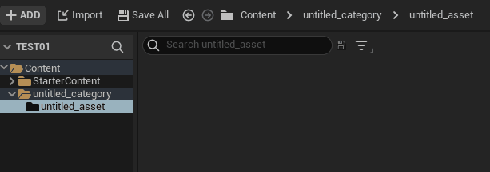
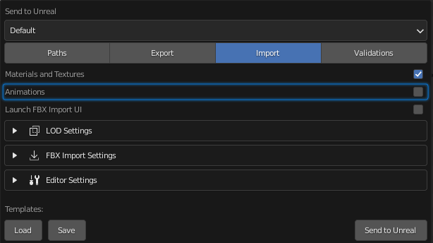

# Skeletal Mesh

The tool infers an Unreal Skeletal Mesh asset based strictly on the content of your `Export` collection. Here is what
it is doing:

!!! note
  
    The armature placed in the `Export` collection must be responsible for deformation, meaning only bones that are
    skinned to a mesh. No bones used for control schemes should be put in the `Export` collection.

The important thing to remember is that only armatures and meshes inside that collection can be used to build the data for the
skeletal mesh export and import.

As you can see, a related mesh and armature combination results in an Unreal Skeletal Mesh asset being generated along with
Materials, a Skeleton, and a Physics Asset. Also notice that the Skeletal Mesh name matches the mesh name in blender, as well
as the skeleton and physics asset with `_Skeleton` and `_PhysicsAsset` post fixed respectively.

To run a strictly skeletal mesh import(meaning no animation will be exported), the animations import option must be
turned off in your [Import](/settings/import.html#animation) settings.

## LODs

LOD workflows for skeletal meshes are supported. Simply activate the LODs option in the LOD Settings group and Send to
Unreal will handle exporting and importing each LOD.

There is a sub category for skeletal meshes that allows you to specify a path to a LOD Settings data asset in your
Unreal project. This can be referenced directly to automatically set your skeletal
mesh lod settings.

!!! note

    If your mesh has a LOD naming scheme and Import LODs is true, the LOD postfix will get stripped out of the final asset name based on the lod regex. For
    example
    `SK_Mannequin_LOD0 = SK_Mannequin`

Also notice that the LOD build settings can be set under the
`Import > Editor Settings > Skeletal Mesh LOD Build Settings` group.

!!! note

    The Editor Settings corresponds to what is available in the [EditorSkeletalMeshLibrary](https://docs.unrealengine.com/4.27/en-US/PythonAPI/class/EditorSkeletalMeshLibrary.html) in the Unreal Python API.

## Only Mesh

To run a strictly mesh asset import (ex: excluding import of particle systems as groom assets), all import options
must be turned off in your [import settings](/settings/import.html) except for `Mesh`.
