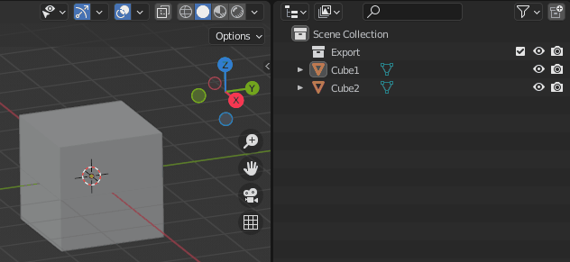
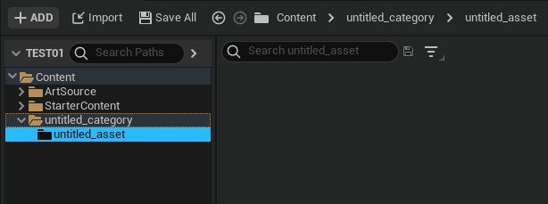
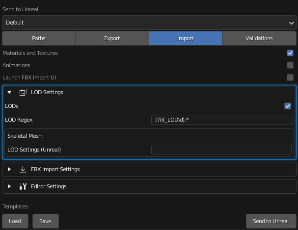
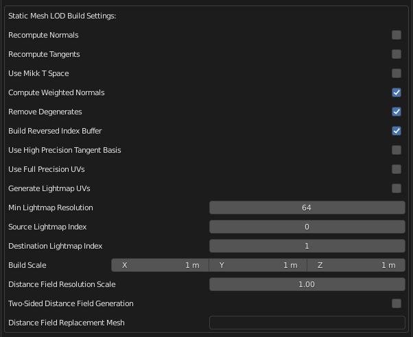
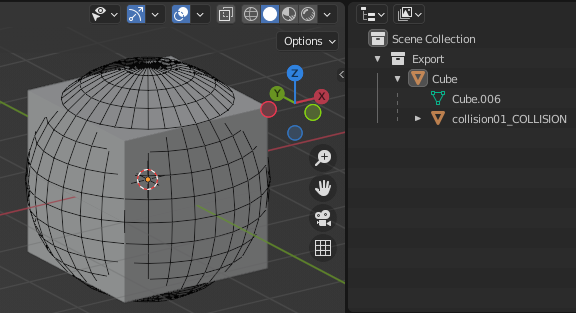
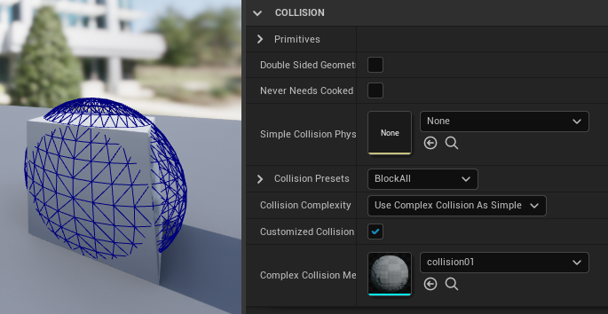
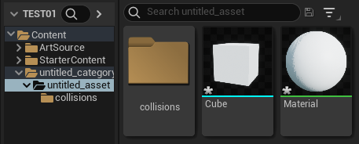
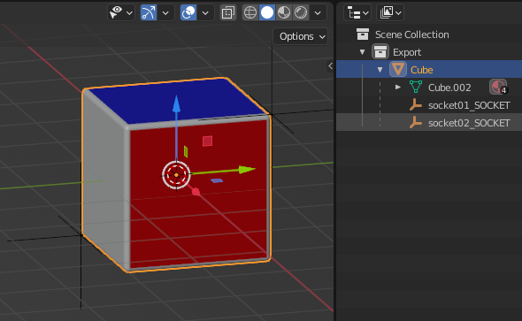

# Static Mesh

Static meshes are simple. The tool looks in the `Export` set for objects of type `MESH` and sends them to unreal as
individual Static Mesh assets to unreal.

In this example, you can see the result is two Unreal Static Mesh assets along with their material.

## LODs

LOD workflows for static meshes are supported. Simply activate the LODs option in the LOD Settings group and Send to
Unreal will handle exporting and importing each LOD.

!!! note

    If your mesh has a LOD naming scheme and Import LODs is true, the LOD postfix will get stripped out of the final asset name based on the lod regex. For
    example:

    `pCube1_LOD0 = pCube1`

    `pCube2_lod0_mesh = pCube2`

Also notice that the LOD build settings can be set under the
`Import > Editor Settings > Static Mesh LOD Build Settings` group.

!!! note

    The Editor Settings corresponds to what is available in the [EditorStaticMeshLibrary](https://docs.unrealengine.com/5.0/en-US/PythonAPI/class/EditorStaticMeshLibrary.html) in the Unreal Python API.

## Collisions

Simple collision workflows for static meshes are supported by prefixing your collision names with their respective identifiers and making them a child of the mesh.

| Mesh Prefix and Name | Description |
| -------------- | ----------------------- |
| `UBX_[RenderMeshName]_##` | A Box must be created using a regular rectangular 3D object. You cannot move the vertices around or deform it in any way to make it something other than a rectangular prism, or else it will not work. |
| `UCP_[RenderMeshName]_##` | A Capsule must be a cylindrical object capped with hemispheres. It does not need to have many segments (8 is a good number) at all because it is converted into a true capsule for collision. Like boxes, you should not move the individual vertices around.|
| `USP_[RenderMeshName]_##` | A Sphere does not need to have many segments (8 is a good number) at all because it is converted into a true sphere for collision. Like boxes, you should not move the individual vertices around. |
| `UCX_[RenderMeshName]_##` | A Convex object can be any completely closed convex 3D shape. For example, a box can also be a convex object. |

The underlying mechanism for this is the Unreal FBX importer, so for further information, please refer to the [FBX Guide for static meshes](https://docs.unrealengine.com/5.0/en-US/WorkingWithContent/Importing/FBX/StaticMeshes/).

Collisions are imported with the asset that matches the `[RenderMeshName]` after the collision prefix.

!!! note

    Collisions must be in the `Export` collection to be exported.

## Sockets

There is a supported workflow for adding sockets to static meshes.

Any child mesh that has the pre fix `SOCKET_` in its name will be separately imported as a socket of its parent.

!!! note

    Socket names have the `SOCKET_` prefix stripped out. `SOCKET_socket_01` in blender becomes `socket_01` in unreal.

## Only Mesh

To run a strictly mesh asset import (ex: excluding import of particle systems as groom assets), all import options
must be turned off in your [import settings](/settings/import.html) except for `Mesh`.
