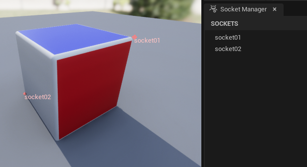

# Static Mesh

Static meshes are simple. The tool looks in the `Export` set for objects of type `MESH` and sends them to unreal as
individual Static Mesh assets to unreal.

In this example, you can see the result is two Unreal Static Mesh assets along with their material.

## LODs

LOD workflows for static meshes are supported. Simply activate the LODs option in the LOD Settings group and Send to
Unreal will handle exporting and importing each LOD.

::: tip Note
  If your mesh has a LOD naming scheme and Import LODs is true, the LOD postfix will get stripped out of the final asset name based on the lod regex. For
example:

`pCube1_LOD0 = pCube1`

`pCube2_lod0_mesh = pCube2`
:::

Also notice that the LOD build settings can be set under the
`Import > Editor Settings > Static Mesh LOD Build Settings` group.

::: tip Note
  The Editor Settings corresponds to what is available in the [EditorStaticMeshLibrary](https://docs.unrealengine.com/4.27/en-US/PythonAPI/class/EditorStaticMeshLibrary.html) in the Unreal Python API:
:::

## Collisions

Custom complex collision workflows for static meshes are supported.

Any child mesh that has the post fix `_COLLISION` in its name will be separately imported as a complex collision of its parent.

::: tip Note
  Collisions names have the `_COLLISION` postfix stripped out. `collision01_COLLISION` in blender become `collision01` in unreal.
:::

Collisions are exported and imported as separate files, so you probably will want to customize their export path and import paths in the [paths](/settings/paths.html) tab

## Sockets

There is a supported workflow for adding sockets to static meshes.

Any child mesh that has the post fix `_SOCKET` in its name will be separately imported as a socket of its parent.

::: tip Note
  Socket names have the `_SOCKET` postfix stripped out. `socket01_SOCKET` in blender become `socket01` in unreal.
:::
