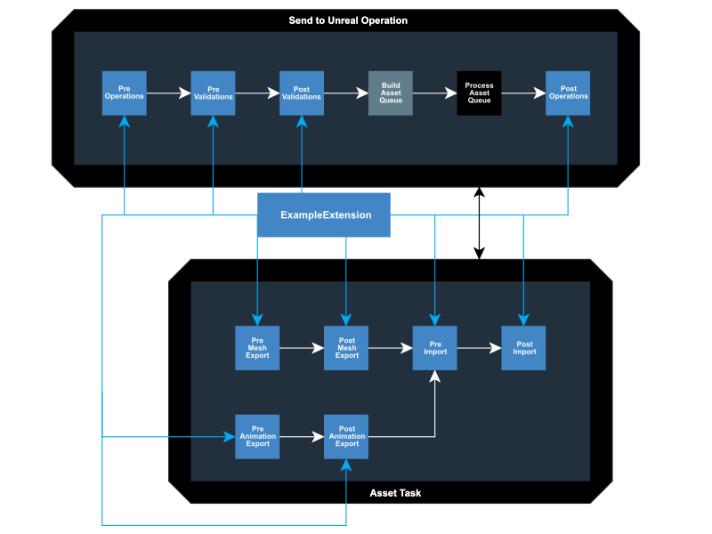
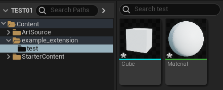
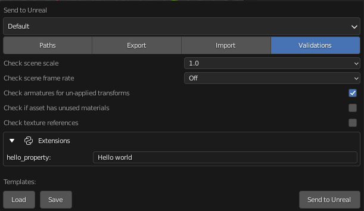

# Extensions

::: warning
This feature set is still very new and could be subject to change.
:::

::: tip Supported Extensions
See the Supported Extensions section for details on extensions that ship with the Send to Unreal addon
and are supported by this repository.
:::

Extensions provide a python interface for Send to Unreal users to quickly and cleanly extend its functionality
with a minimal amount of code. Within an extension class several things can be defined:
* [Tasks](/customize/extensions.html#tasks)
* [Properties](/customize/extensions.html#properties)
* [Draws](/customize/extensions.html#draws)



In this diagram each blue arrow that plugs into a blue block represents how the extension factory takes
pieces of your extension class and plugs in its logic within the send to unreal operation.

::: tip Note
  The queue can run many asset tasks, therefore the extension logic added in the asset task area will be fired as many
times as there are assets. However, anything outside the asset task will be run once per send to unreal operation.
:::

## Example
Here is a simple example

### The Code
```python
import bpy
from pprint import pprint
from send2ue.core.extension import ExtensionBase

class ExampleExtension(ExtensionBase):
    name = 'example'
    hello_property: bpy.props.StringProperty(default='Hello world')

    def draw_validations(self, dialog, layout, properties):
        row = layout.row()
        row.prop(self, 'hello_property')

    def pre_operation(self, properties):
        properties.unreal_mesh_folder_path = '/Game/example_extension/test/'

    def pre_validations(self, properties):
        if self.hello_property != 'Hello world':
            return False
        return True

    def pre_mesh_export(self, asset_data, properties):
        pprint(asset_data)
```

This adds a property, a pre operation task that changes the `unreal_mesh_folder_path` value, a pre mesh export task
that prints out the asset data of the mesh, and a validation that checks to ensure that `hello_property` is
equal to "Hello world", otherwise it returns False which terminates the send to unreal
operation execution.

::: tip Note
  At minimum, an extension must have the class attribute `name` defined. Everything else is optional. A more
advanced extension example is available
[here](https://github.com/EpicGames/BlenderTools/blob/master/tests/test_files/send2ue_extensions/example_extension.py).
:::

### Installation
Save the extension code in a folder. This folder is know as the `Extensions Repo Folder`. You can place as many extensions
in this folder as needed. In this example, the file is saved to`C:\extension_repo\example.py`.


Then in the Send to Unreal addon preferences set the `Extensions Repo Folder` to `C:\extension_repo`. Then click the
`Reload Extensions` button.

::: tip Note
  Alternatively, this can be installed with python:
```python
# this is handy for reloading your changes as you develop extensions
bpy.context.preferences.addons['send2ue'].preferences.extensions_repo_path = 'C:\extension_repo'
bpy.ops.send2ue.reload_extensions()
```
:::

### Test
Now when we use Send to Unreal to with the default cube, we can see the `asset_data` dictionary printing in the
console and that the cube got sent to the `/Game/example_extension/test/` folder in the unreal project.



This same approach can be applied to many other use cases where you need to extend the Send to Unreal operation.
For practical examples check out the
[send2ue/resources](https://github.com/EpicGames/BlenderTools/tree/master/send2ue/resources/extensions) folder.

## Tasks
Tasks contain logic for key points within the runtime of the send to unreal
operation. This is done by registering methods on the extension's property group class. When the Send to Unreal
operation gets run, the extension tasks get executed. The methods below can be implemented in an extension class and the Send to Unreal
extension factory will inject the tasks.

#### _filter_objects_
Defines a filter for the armature and mesh objects after they have been initially collected.
- param `list[bpy.types.Object]` `armature_objects` A list of armature objects.
- param `list[bpy.types.Object]` `mesh_objects` A list of mesh objects.
- returns A tuple which is a filtered list of armature objects, and a filtered list of meshes objects.
- rtype tuple(list, list)
```python
filter_objects(self, armature_objects, mesh_objects)
```

#### _pre_operation_
Defines the pre operation logic that will be run before the send to unreal operation.
- param `Send2UeSceneProperties` `properties` The scene property group that contains all the addon properties.
```python
pre_operation(self, properties)
```

#### _post_operation_
Defines the post operation logic that will be run before the send to unreal operation.
- param `Send2UeSceneProperties` `properties` The scene property group that contains all the addon properties.
```python
post_operation(self, properties)
```

#### _pre_validations_
Defines the pre validation logic that will be an injected operation.
- param `Send2UeSceneProperties` `properties` The scene property group that contains all the addon properties.
- return `bool` Whether or not the validation has passed.
```python
pre_validations(self, properties)
```

#### _post_validations_
Defines the post validation logic that will be an injected operation.
- param `Send2UeSceneProperties` `properties` The scene property group that contains all the addon properties.
- return `bool` Whether or not the validation has passed.
```python
post_validations(self, properties)
```

#### _pre_animation_export_
Defines the pre animation export logic that will be an injected operation.
- param `dict` `asset_data` A mutable dictionary of asset data for the current asset.
- param `Send2UeSceneProperties` `properties` The scene property group that contains all the addon properties.
```python
pre_animation_export(self, asset_data, properties)
```

#### _post_animation_export_
Defines the post animation export logic that will be an injected operation.
- param `dict` `asset_data` A mutable dictionary of asset data for the current asset.
- param `Send2UeSceneProperties` `properties` The scene property group that contains all the addon properties.
```python
post_animation_export(self, asset_data, properties)
```

#### _pre_mesh_export_
Defines the pre mesh export logic that will be an injected operation.
- param `dict` `asset_data` A mutable dictionary of asset data for the current asset.
- param `Send2UeSceneProperties` `properties` The scene property group that contains all the addon properties.
```python
pre_mesh_export(self, asset_data, properties)
```

#### _post_mesh_export_
Defines the post mesh export logic that will be an injected operation.
- param `dict` `asset_data` A mutable dictionary of asset data for the current asset.
- param `Send2UeSceneProperties` `properties` The scene property group that contains all the addon properties.
```python
post_mesh_export(self, asset_data, properties)
```

#### _pre_import_
Defines the pre import logic that will be an injected operation.
- param `dict` `asset_data` A mutable dictionary of asset data for the current asset.
- param `Send2UeSceneProperties` `properties` The scene property group that contains all the addon properties.
```python
pre_import(self, asset_data, properties)
```

#### _post_import_
Defines the post import logic that will be an injected operation.
- param `dict` `asset_data` A mutable dictionary of asset data for the current asset.
- param `Send2UeSceneProperties` `properties` The scene property group that contains all the addon properties.
```python
post_import(self, asset_data, properties)
```

## Utility Operators
Utility operators are authored just like you would author any other blender operator. The class attribute
`utility_operators` is a place where a list of operator classes can be assigned. This list of operator classes will be
auto registered and added to the utilities submenu under `Pipeline > Utilities`
```python
class ExtensionBase:
    utility_operators = [
        YourOperatorClass
    ]
```

Refer to the [blender API docs](https://docs.blender.org/api/current/bpy.types.Operator.html) for more information.

## Properties
Extension properties must be defined in the extension class's annotations. This is done using the `:` instead of `=`
for assignment like so:
```python
class ExampleExtension(ExtensionBase):
    name = 'example'
    hello_property: bpy.props.StringProperty(default='Hello world')
```
::: tip Note
  Properties can be any property type in `bpy.props`
:::

All properties defined in the extension class get registered as a sub property group within the
`send2ue` scene data hierarchy. In the above example, the `hello_property` could be accessed within an
extension task method like:
```python
self.hello_property
```
Or globally like:
```python
bpy.context.scene.send2ue.extensions.example.hello_property
```

::: tip Note
  Extension properties get saved when the blend file is saved, and can have their values saved to templates
just like the default properties that exist in the Send to Unreal tool.
:::

## Asset Data Dictionary
During the life cycle of the Send to Unreal operation a dictionary `asset_data` is created that contains all assets
that will be sent in the operation. Per asset, data gets fetched and passed into the task method via the `asset_data`
param in certain extension task methods. i.e `pre_mesh_export(self, asset_data, properties)`.


::: tip Note
  Any `asset_data` dictionary value that is prefixed with `_` i.e. `_asset_type` etc. has no effect on how Send to Unreal uses
that data. However, changing values not prefixed with an underscore will change the Send to Unreal behavior.
:::

Here is an example of a potential renaming use case.
```python
from send2ue.core.extension import ExtensionBase
class ExampleExtension(ExtensionBase):
    name = 'example'
    def pre_mesh_export(self, asset_data, properties):
        # the asset data using the current asset id
        path, ext = asset_data['file_path'].split('.')
        asset_path = asset_data['asset_path']

        asset_data['file_path'] = f'{path}_added_this.{ext}'
        asset_data['asset_path'] = f'{asset_path}_added_this'
        pprint(asset_data)
        self.update_asset_data(asset_data)
```
Here you can see that we forced a rename of the asset by changing the fbx name, then we updated the asset path so that
Send to Unreal would still have a reference to the imported asset.

::: tip Note
  In order for the `asset_data` to be updated you must call `self.update_asset_data(asset_data)` like shown above.
:::

This is what the Mesh's `asset_data` looks like from the example above after being modified:
```python
{
 '_asset_type': 'MESH',
 '_mesh_object_name': 'Cube1',
 'asset_folder': '/Game/example_extension/test/',
 'asset_path': '/Game/example_extension/test/Cube1_added_this',
 'file_path': 'C:\\Users\\User~1\\AppData\\Local\\Temp\\blender\\send2ue\\data\\mesh\\Cube1_added_this.fbx',
 'import_mesh': True,
 'lods': None,
 'skeletal_mesh': False,
 'skeleton_asset_path': '',
 'sockets': {}
}
```
::: warning
Modifying this dictionary incorrectly will produce errors. You must implement your own validations to ensure this
is modified correctly.
:::

## Draws
Defining draws for your extension is a way to make your extension properties available to be edited by the user.
Using the same example extension above, the `draw_validations` implementation adds this UI into the Send to
Unreal Settings Dialog.



#### _draw_validations_
Can be overridden to draw an interface for the extension under the validations tab.
- param `Send2UnrealDialog` `dialog` The dialog class.
- param `bpy.types.UILayout` `layout` The extension layout area.
- param `Send2UeSceneProperties` `properties` The scene property group that contains all the addon properties.
```python
draw_validations(self, dialog, layout, properties)
```

#### _draw_export_
Can be overridden to draw an interface for the extension under the export tab.
- param `Send2UnrealDialog` `dialog` The dialog class.
- param `bpy.types.UILayout` `layout` The extension layout area.
- param `Send2UeSceneProperties` `properties` The scene property group that contains all the addon properties.
```python
draw_export(self, dialog, layout, properties)
```

#### _draw_import_
Can be overridden to draw an interface for the extension under the import tab.
- param `Send2UnrealDialog` `dialog` The dialog class.
- param `bpy.types.UILayout` `layout` The extension layout area.
- param `Send2UeSceneProperties` `properties` The scene property group that contains all the addon properties.
```python
draw_import(self, dialog, layout, properties)
```

#### _draw_paths_
Can be overridden to draw an interface for the extension under the paths tab.
- param `Send2UnrealDialog` `dialog` The dialog class.
- param `bpy.types.UILayout` `layout` The extension layout area.
- param `Send2UeSceneProperties` `properties` The scene property group that contains all the addon properties.
```python
draw_paths(self, dialog, layout, properties)
```

## RPC Library
There is a submodule within `send2ue` that can be used to make your own rpc calls. Here is
a basic example of how you can force an asset to be renamed in the `post_import` method of an extension.
```python
from send2ue.core.extension import ExtensionBase
from send2ue.dependencies.unreal import remote_unreal_decorator


@remote_unreal_decorator
def rename_unreal_asset(source_asset_path, destination_asset_path):
    if unreal.EditorAssetLibrary.does_asset_exist(destination_asset_path):
        unreal.EditorAssetLibrary.delete_asset(destination_asset_path)
    return unreal.EditorAssetLibrary.rename_asset(source_asset_path, destination_asset_path)

class ExampleExtension(ExtensionBase):
    name = 'example'
    def post_import(self):
        asset_path = self.asset_data[self.asset_id]['asset_path']
        rename_unreal_asset(asset_path, f'{asset_path}_renamed_again')
```
Notice how you can define remote unreal functions on the fly by just wrapping your function
with the `remote_unreal_decorator`. The RPC library has a factory that takes care of teleporting
your code and imports over to the open unreal editor.

::: tip Note
  RPC calls must be defined as function or a staticmethod of a class, and only basic python data types
can be marshalled through the function parameters. No object params or kwargs are excepted.
:::


