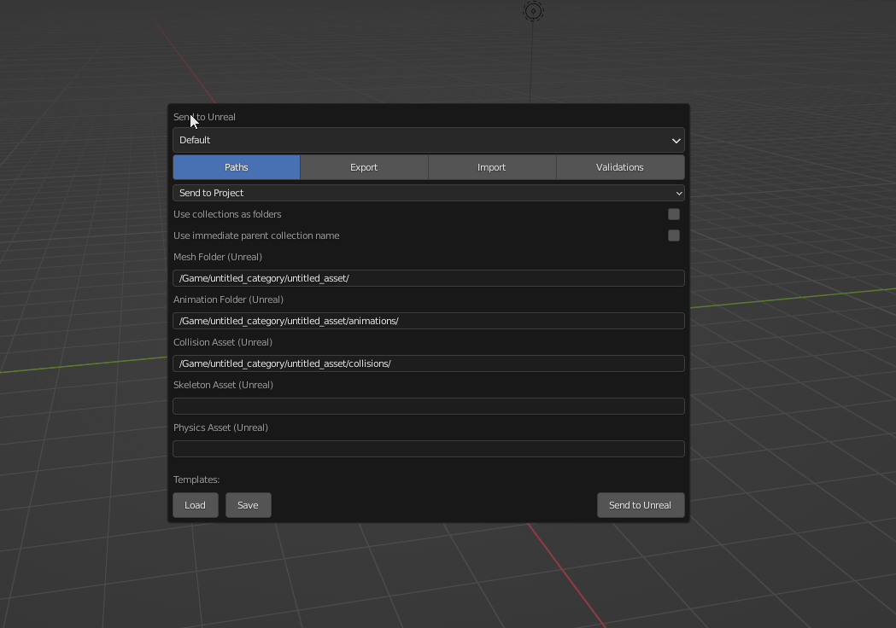
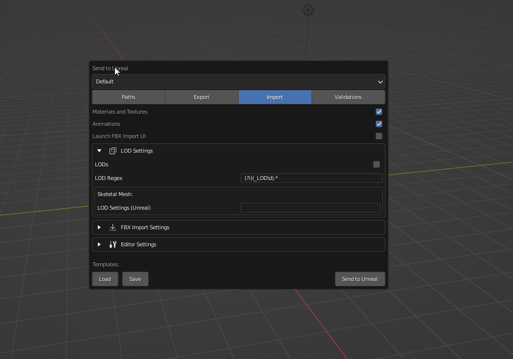

# Templates
A powerful feature of Send to Unreal is that you can configure `Setting Templates` which are just json files that can
be shared among your team members. These templates contain the values of every Send to Unreal property in the tool. This
could be useful to help "standardize" your pipeline by ensuring everyone is using the correct export
and import settings, or just help speed up a workflow by minimizing clicks.

## Saving a Template
A template can be saved within the Settings Dialog. Take the following example of saving your settings
that have been configured to support LODs.

Once your properties are set to your liking you can click `Save` then choose a location
and a file name for your template on disk. This file can be shared with your team or you can load it in to use
later.

## Loading a Template
A template can be loaded within the Settings Dialog. Continuing with the example above, we can load in the settings
template that has been configured to for LODs. Click `Load` then choose the location of the template file on disk.

!!! note

    The properties won't change until the active template is selected from the dropdown. Loading the template
    makes the template available in the dropdown, but does not modify the properties.
