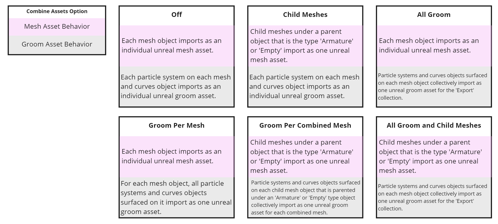
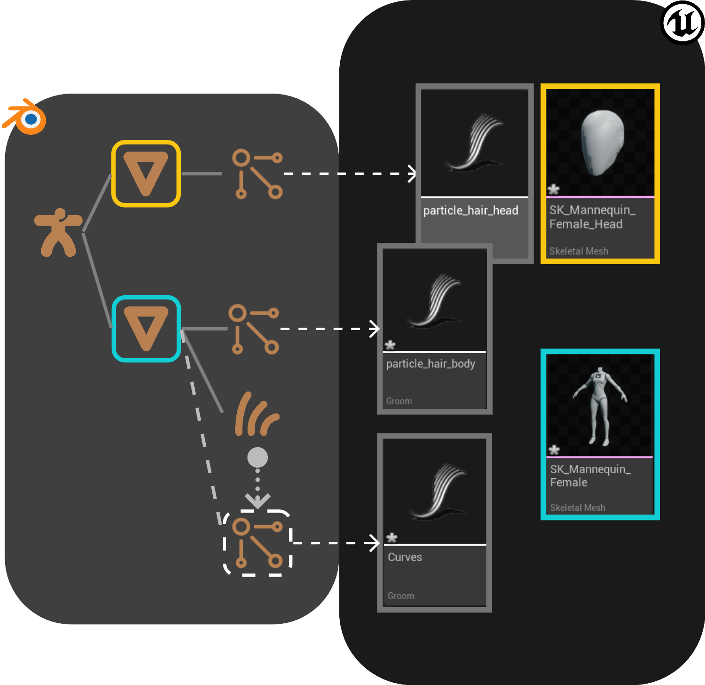
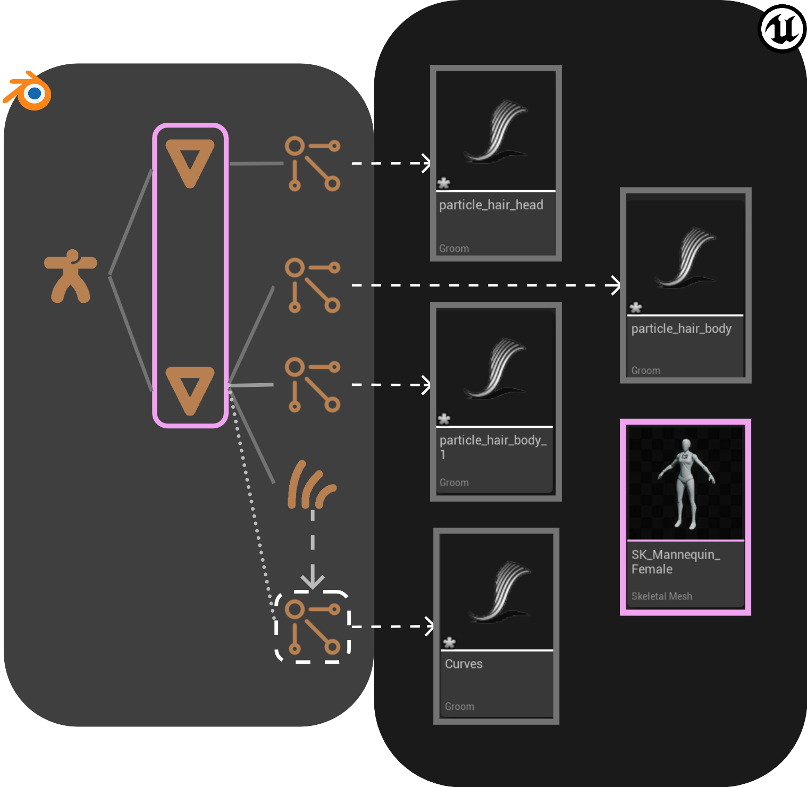
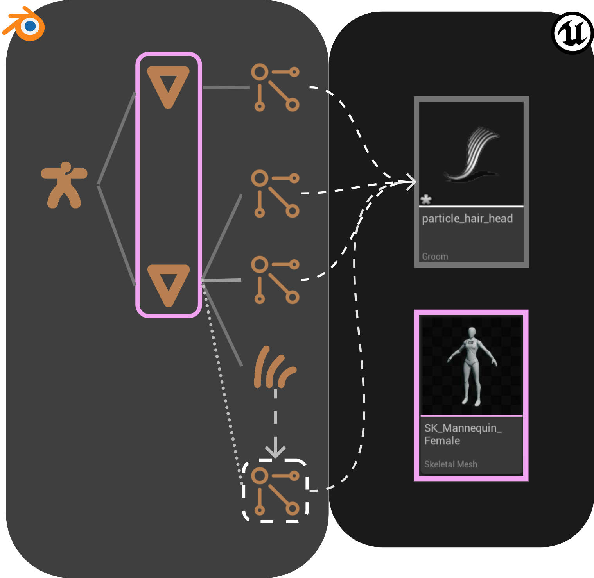

# Combine Assets

The _Combine Assets_ extension provides a convenient way to combine blender objects into one unreal asset. There are 4
options, each provides a different way to customize your export.

## Overview

## Properties
## Combine
#### _off_
This exports each object and particle system in the `Export` collection as individual assets.

#### _child meshes_
For each empty object or armature parent, this combines its child meshes into a single mesh when exported.

#### _groom per mesh_
For each mesh in the Export collection, this combines every hair objects/systems surfaced on the mesh as a single groom asset.

#### _groom per combined mesh_
For each empty object or armature parent, this combines its child meshes into a single mesh when exported.
For each combined mesh, all hair objects/systems surfaced on it export as a single groom asset.

## UI
The settings can be found under the `Export` tab

## Static Meshes
For options _**child meshes**_, and _**groom per combined mesh**_, all child meshes under an empty
will be combined into one static mesh using the name of the empty.

In this example the name of the combine static mesh in unreal would be `CombinedCubes`

::: tip Note
 When using this with custom collisions, each collision name must correspond to each mesh name, not the final
combined Static Mesh asset name.

In this example the final name of the combined asset is `S_Boards_Platform_1x1` and all the collisions below match
to each mesh within the combined asset.

:::

## Skeletal Meshes
For options _**child meshes**_, and **_groom per combined mesh_**, all child meshes under an armature
will be combined into one skeletal mesh using the name of the first child mesh in alphanumerical order by object name
(the default order of objects in the blender outliner).

::: tip Note
 This might not give you enough control over the skeletal mesh name, so using the
[immediate parent name](https://epicgames.github.io/BlenderTools/send2ue/extensions/use-immediate-parent-name.html)
extension can be useful.
:::

In this example the name of the combine skeletal mesh in unreal would be `SK_Mannequin_Female`

## Groom
* For the options _**off**_ and _**child meshes**_, each particle system and curves object exports as an individual alembic file.
The imported groom asset takes on the name of the particle system or curves object.

* For the option _**groom per mesh**_ and _**groom per combined mesh**_, all particle systems and curves objects surfaced to one mesh
  will be combined into one groom asset using the name of their surface mesh post fixed with `_Groom`.
