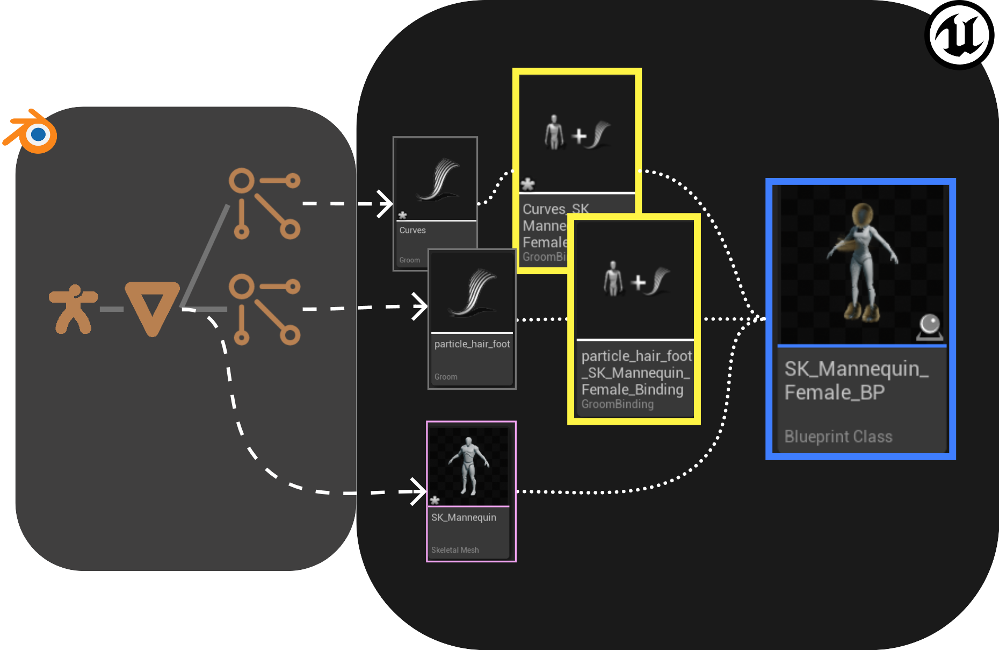
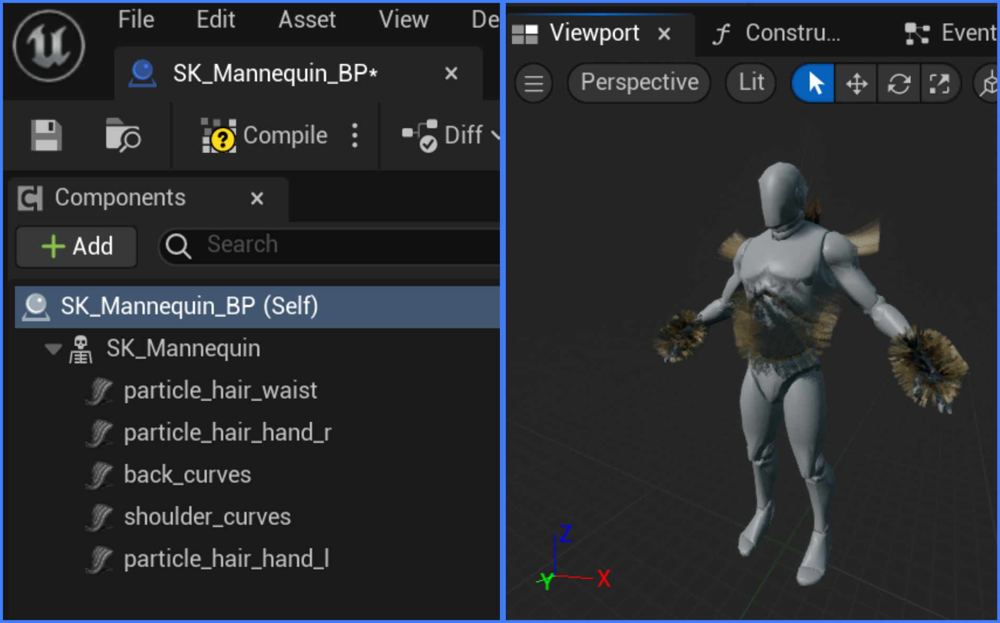

# Create Post Import Assets For Groom
The _Create Post Import Assets For Groom_ extension provides a convenient way to create additional unreal assets related to the
imported groom asset.

## Properties
### Groom Binding Asset
This creates a binding asset for the imported groom asset. The target skeletal mesh is the hair's surface mesh in blender
that is part of the same import. For this option to work correctly, the _import mesh_ and _import groom_ options in the
[import settings](https://poly-hammer.github.io/BlenderTools/send2ue/settings/import.html) must be turned on.

The binding asset will use the name of the groom asset and the name of the target skeletal mesh post fixed with `_Binding`.
Note this is the unreal convention of naming binding assets.

For example, a groom asset sourced from a particle system named `hair` with a surface mesh named `SK_Mannequin_Female`
will yield a binding asset named `hair_SK_Mannequin_Female_Binding`.

!!! note

    A binding asset can only be created when the groom's surface mesh is a [skeletal mesh](https://poly-hammer.github.io/BlenderTools/send2ue/asset-types/skeletal-mesh.html).

### Blueprint Asset with Groom
This creates a blueprint asset for each imported skeletal mesh and its surface hairs. The blueprint asset will have
one skeletal mesh component and one or more groom components created from the imported mesh and groom assets. The
blueprint asset uses the name of the skeletal mesh asset with a postfix `_BP`.

- In the example below, a blueprint asset created with the skeletal mesh `SK_Mannequin` is named `SK_Mannequin_BP`.
    There are multiple hair systems surfaced on the mesh object `SK_Mannequin`, which results in a groom
    component created for each groom asset imported.

  

!!! note

    Each groom component is automatically populated with a groom asset and a binding asset that connects the groom to the
    skeletal mesh in the skeletal mesh component. For this reason, the _**binding asset**_ option must be turned
    on for the _**blueprint asset with groom binding**_ option to work correctly.

## UI
The settings can be found under the `Import` tab
