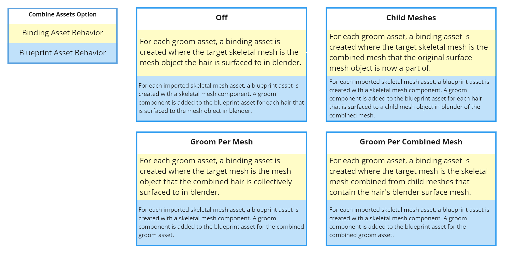

# Create Post Import Groom Assets
The _Post Import Groom Assets_ extension provides a convenient way to create additional unreal assets related to the
imported groom asset.

## Properties
### _Groom Binding Asset_
This creates a binding asset for the imported groom asset. The target skeletal mesh is the hair's surface mesh in blender
that is part of the same import. For this option to work correctly, the _import mesh_ option in the
[import settings](/settings/import.html) must be turned on.

The binding asset will use the name of the groom asset and the name of the target skeletal mesh connected with
underscore, and a postfix `_Binding`. Note this is the unreal convention of naming binding assets.

For example, a groom asset sourced from a particle system named `hair` with a surface mesh named `SK_Mannequin_Female`
will yeeeeield a binding asset named `hair_SK_Mannequin_Female_Binding`.

::: tip Note
A binding asset can only be created when the groom's surface mesh is a [skeletal mesh](/asset-types/skeletal-mesh.html).
:::

### _Blueprint Asset with Groom Binding_
This creates a blueprint asset for each imported skeletal mesh and its surface hairs. The blueprint asset will have
one skeletal mesh component and one or more groom components created from the imported mesh and groom assets. The
blueprint asset uses the name of the skeletal mesh asset with a postfix `_BP`.

- In the example below, a blueprint asset created with the skeletal mesh `SK_Mannequin` is named `SK_Mannequin_BP`.
    There are multiple hair systems surfaced on the mesh object `SK_Mannequin`, which results in a groom
    component created for each groom asset imported.

  

::: tip Note
Each groom component is automatically populated with a groom asset and a binding asset that connects groom to the
skeletal mesh in the skeletal mesh component. For this reason, the _**binding asset**_ option must be turned
on for the _**blueprint asset with groom binding**_ option to work correctly.
:::

## UI
The settings can be found under the `Import` tab

## Usage with _Combine Assets_
Combined usage of the _**create post import groom assets**_ and
[_combine assets_](https://github.com/EpicGames/BlenderTools/docs/send2ue/extensions/combine-assets.html)
extensions is supported. See chart below for the expected behaviors of binding asset and blueprint asset creation
when used with _combine assets_ options.

::: tip Note
No binding asset or blueprint asset will be created when using _Combine Assets_ options _**all groom**_ and
_**all groom and child meshes**_. Since these two options combine all particle systems and curves objects within
the `Export` collection, there is no appropriate target mesh for the `Combined_Groom` to bind to.
:::
