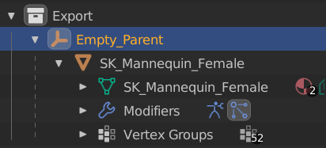

# Use Immediate Parent Name
Gives the user more control over the naming of the assets sent to unreal with the asset taking on the name of its immediate parent that is either a collection or an empty type object.

## Properties
### use immediate parent name
When active, this makes the immediate parent the name of the asset if the immediate parent is a collection or an empty type object. This setting can be used concurrently with import LODs or combine meshes.

{style: "width: 250;"}

In the outliner pictured above, the imported static mesh would be named `Empty_Parent`

!!! note
A mesh under an armature will take the name of the armature's immediate parent if the immediate parent is an empty type object or a collection.

{style: "width: 250;"}

In the outliner pictured above, the imported skeletal mesh would be named `SK_Collection`

### UI
The settings can be found under the `Paths` tab

!!! warning

    Exclusive Usage Extension. `Use Immediate Parent Name` is an **exclusive usage extension**, which means that an error will be raised if it is used in combination with another exclusive usage extension.
