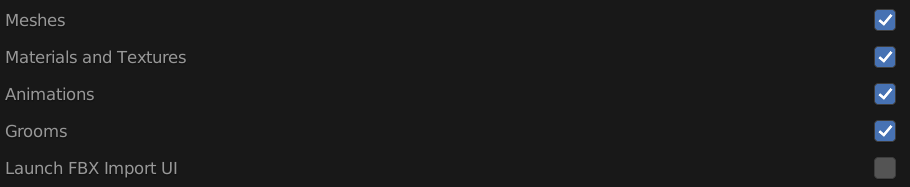

# Import
The following properties dictate what and how assets are imported into unreal.

#### Meshes
Whether or not to import meshes from the FBX file.

#### Materials and Textures
Whether or not to import the materials and textures from the FBX file.

#### Animation
Whether or not to import the animation from the FBX file.

#### Groom
Whether or not to export groom as an alembic file and import to unreal.

#### Launch Import UI
When enabled this option launches the import UI in Unreal.

::: tip Note
  This will launch the Import UI on the first import of the asset, however it will not launch the UI again on a
reimport. If you want to reimport an asset with new custom settings, the recommendation is to delete the asset in your
unreal project and then just run Send to Unreal again.
:::

## LOD Settings
The section contains the settings related to LOD workflows. You can read more about these under the
[Skeletal Mesh](/asset-types/skeletal-mesh.html#lods) and [Static Mesh](/asset-types/static-mesh.html#lods) pages.

#### LODs
Whether or not to export the custom LODs

#### LOD Regex
Set a regular expression to determine an asset's lod identifier. The remaining unmatched string will be used as the
asset name. The first matched group's last character should be the LOD index.

### Skeletal Mesh
#### LOD Settings (Unreal)
This is the direct path to the LOD settings data asset in your unreal project. You can get this path
by right-clicking on the LOD settings data asset in Unreal and selecting "Copy Reference"

## FBX Import Settings
This section exposes the following editor properties with the Unreal Python API.
- [FbxSkeletalMeshImportData](https://docs.unrealengine.com/4.27/en-US/PythonAPI/class/FbxSkeletalMeshImportData.html)
- [FbxStaticMeshImportData](https://docs.unrealengine.com/4.27/en-US/PythonAPI/class/FbxStaticMeshImportData.html)
- [FbxAnimSequenceImportData](https://docs.unrealengine.com/4.27/en-US/PythonAPI/class/FbxAnimSequenceImportData.html)
- [FbxTextureImportData](https://docs.unrealengine.com/4.27/en-US/PythonAPI/class/FbxTextureImportData.html)

## Editor Settings
This section exposes the following editor properties with the Unreal Python API.
- ### Static Mesh
    - [MeshBuildSettings](https://docs.unrealengine.com/4.27/en-US/PythonAPI/class/MeshBuildSettings.html)

- ### Skeletal Mesh
    - [SkeletalMeshBuildSettings](https://docs.unrealengine.com/4.27/en-US/PythonAPI/class/SkeletalMeshBuildSettings.html)
