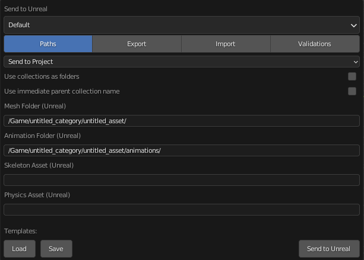
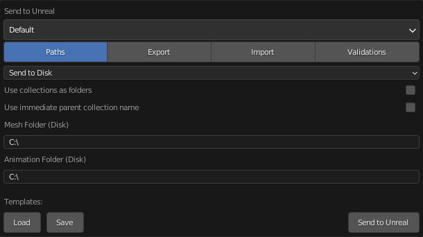
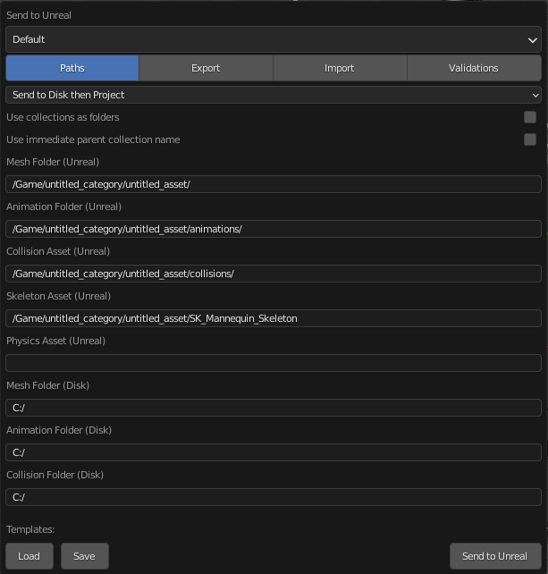
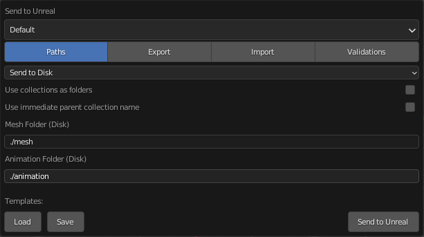

# Paths
The `Paths` section of the settings dialog is where all export and import paths can be configured.  There are several
different paths available depending on which `Path Mode` is selected:

## Path Modes
Select which path mode Send to Unreal should use.

### Send to Project
Sends the intermediate files to a temporary location on disk and then imports them into
the Unreal Project. This doesn't require any extra configuration, but might not be ideal if your intermediate files
need to be under source control.

{style: "width: 500;"}

### Send to Disk
Sends the intermediate files to a specified location on disk and does not import them.

{style: "width: 500;"}

### Send to Disk then Project
Sends the intermediate files to a specified location on disk and then imports them into
the Unreal Project. This requires extra paths to be configured, but is ideal if your intermediate files
need to be under source control.

{style: "width: 500;"}

## Relative Paths
When specifying a location on disk with either the `Send to Disk` or `Send to Disk then Project`, relative paths
can be used if the blender file is saved.  The paths are relative to the currently open blender file.

{style: "width: 500;"}

!!! note

    A relative disk path is relative to where the blend file is saved on disk.

## Path Properties
#### Mesh Folder (Unreal):
This is the mesh import path. All your static and skeletal meshes will be imported to this location in your open
unreal project.

#### Animation Folder (Unreal):
This is the animation import path. All your actions that are in an Armature object’s NLA strips will be imported to
this location in your open Unreal Project.

#### Groom Folder (Unreal):
This is the groom import path. All your particle hair systems and Curves objects will be imported to this location in
your open unreal project.

#### Skeleton Asset (Unreal):
This is the direct path to the Skeleton you want to import animation on. You can get this path by
right-clicking on the skeleton asset in Unreal and selecting "Copy Reference".

#### Physics Asset (Unreal):
This is the direct path to the physics asset you want to use. You can get this path by
right-clicking on the physics asset in Unreal and selecting "Copy Reference"

#### Mesh Folder (Disk):
This is the path to the folder where meshes are exported on disk. All your static and skeletal
meshes will be exported to this location. The file names will match the name of the mesh in maya

#### Animation Folder (Disk):
This is the path to the folder where your animations will be exported to on disk. All your action strips
that are in the NLA Editor will be exported to this location. The file names will match
the action name in blender.

#### Groom Folder (Disk):
This is the path to the folder where your particle hair systems and curves objects will be exported t on disk.
The file names will match the particle system or curves object name in blender.
