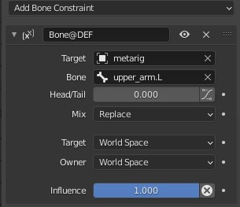
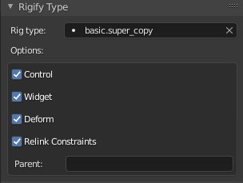
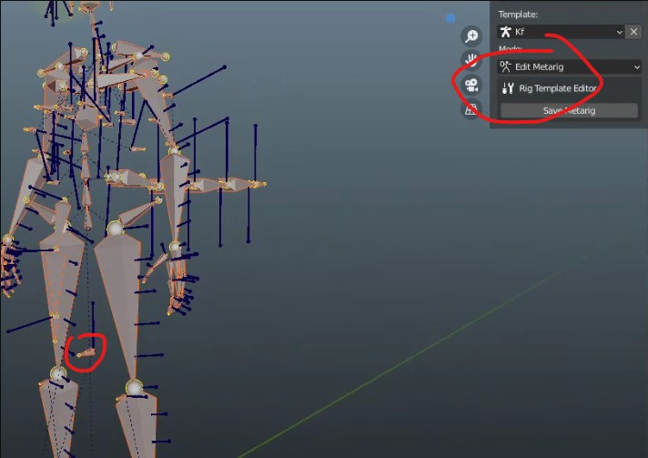
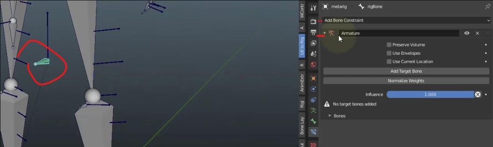
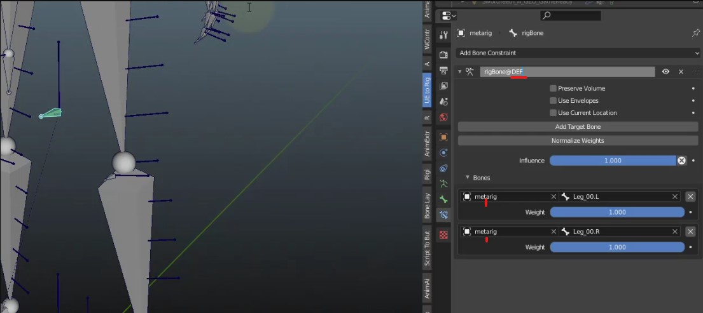

# Relink Constraints

[UE to Rigify Customization](https://docs.blender.org/manual/en/latest/addons/rigging/rigify/rig_types/basic.html)
allows retargeting constraints belonging to the bone to point at bones created in the process of generating the rig,
thus allowing custom rigging to integrate with generated bones.

To use this feature, add `@` and the intended target bone name to the constraint name, resulting in the `...@bone_name`
syntax. After all bones of the rig are generated, the constraint target bone will be replaced. If the new bone name is
just `CTRL`, `MCH` or `DEF`, this will just replace the `ORG` prefix in the existing target bone name. For the Armature
constraint you can add a `@` suffix for each target, or just one `@CTRL`, `@MCH` or `@DEF` suffix to update all.

### Parent
If the field is not empty, applies the same name substitution logic to the parent of the bone.

When this feature is enabled, the bone will not be automatically parented to the root bone even if it has no parent;
enter root in the Parent field if that is necessary.

### Relinking Constraints
Set the UE to Rigify mode to "Edit Metarig"

While edit mode is enabled, create the new bone you want to rig "rigBone". In this case it is a bone that will help the
pants deform. We need to have it constrained between the legs once the Rigify rig is built.

Setup the Rigify type on the new bone. Switch to Pose mode and with the "rigBone" selected go to the Bone Properites
tab. In the Rigify Type-Rig Type, selct raw copy or super_copy as these settings will allow us to use the relink
constraint feature.

Now add an armature constraint to the "rigBone" and pick your constraint targets from the metarig. To have the relink
setting work, the constraint name must match the bone name it is on, "rigBone" and for the targets you must add a
prefix. In this example @DEF is the prefix for the bones created in the Rigify Rig. Right now the target will be the
Metarig armature and bones.

Save the Metarig and switch to Control mode. Select the "rigBone" and notice that the target armatre and bones have
changed to be the newly created control Rigify rig and bones, DEF-Leg_00.L as an example. This means that the target
for the constraint has switched to the DEF bone created when the rig was built. The custom rig is complete and remains
part of the Metarig template so that you don't lose the custom rigging created using constraints.

