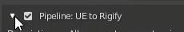
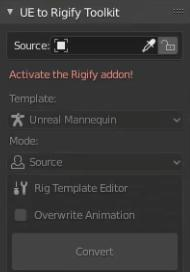
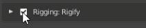
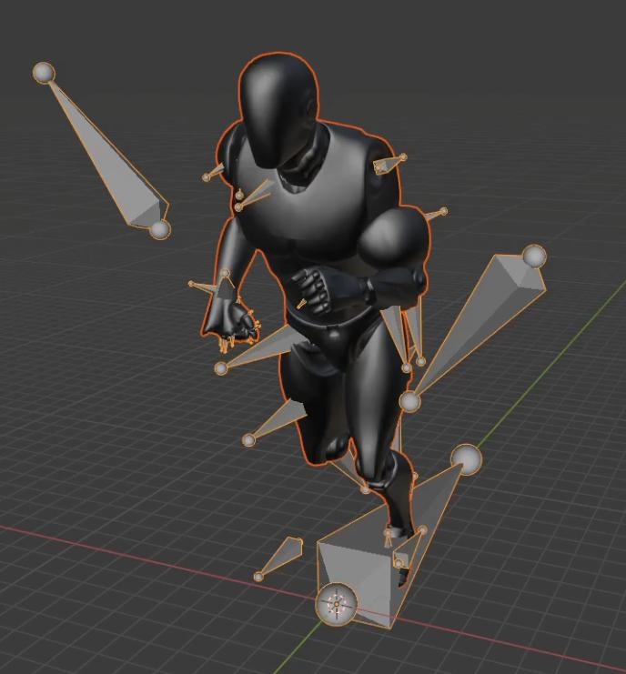

# Quickstart

This quick start guide will help you get up and running with the UE to Rigify addon.

First thing you need to do is download the latest versioned zip file from the [releases page](https://github.com/poly-hammer/BlenderTools/releases?q=UE+to+Rigify&expanded=true)
under the `Assets` dropdown. The zip file name will start with `ue2rigify`.

Open Blender and install the add on. Go to `Edit > Preferences` then to addons. Click `install`.

Go to the location where you have your addon on disk and install the zip file. Once installed. Go ahead and activate it.

In the 3D View , if you hit `N` you can see the `UE to Rigify Toolkit` in the side panel. If Rigify is not active you will get this message: "Activate the Rigify addon!"

Make sure that the Rigify addon is active. Rigify is a dependency for this addon to work correctly.

Now I'm just going to import an FBX file. This is just the standard third person mannequin with the run animation.

Now that it's imported. All I have to do now is go over to the UE to Rigify Panel, and get the picker and select the source rig.

Then just hit Convert.

You can now see that ‘UE to Rigify’ has converted our mannequin character and the third person run animation into a Rigify rig, and the run cycle has been transferred over as well.

You can now control your original "Source" rig with the new Rigify "Control" rig!
