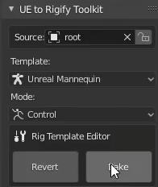

# Animation

<iframe src="https://www.youtube.com/embed/r3ORukeV_70" frameborder="0" allow="accelerometer; autoplay; clipboard-write; encrypted-media; gyroscope; picture-in-picture" allowfullscreen style="position: absolute; top: 0; left: 0; width: 100%; height: 100%;"></iframe>

Let's talk about the animation workflow with UE to Rigify. When you have an animation on your "Source" rig and you
click `Convert` and switch to `Control` mode, a new Rigify rig is being created and the key frames from your original
source rig are being copied over into a new action on that rig.

So let's take a look at this current action on this "Source" rig called `run`.

When I hit `Convert`. It converts that action over to the Rigify rig.

::: tip Note
   UE to Rigify renames the original action to have `SOURCE_` in front of it. It prefixes every action from
the "Source" rig so it does not overwrite any bone animations just in case the Rigify "Control" rig and the "Source"
rig happen to have matching bone names.
:::

Then I would click `Bake`, and confirm.

Now we're back to our "Source" rig. Now our "Source" rig has the new animation on our original bones. Now the
modified rig can be exported to a file!
