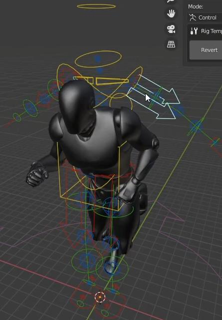
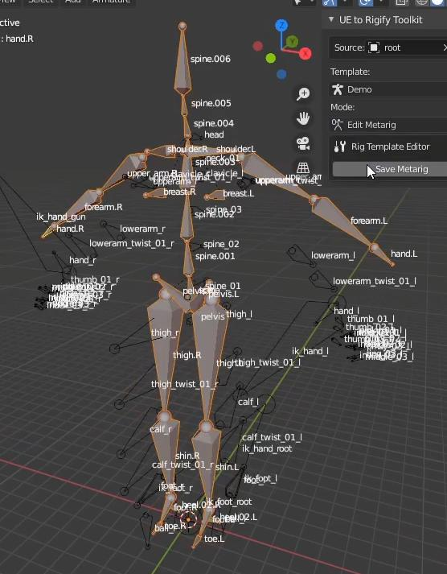
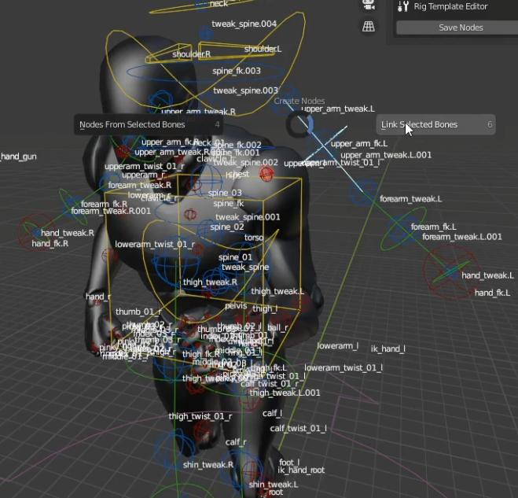
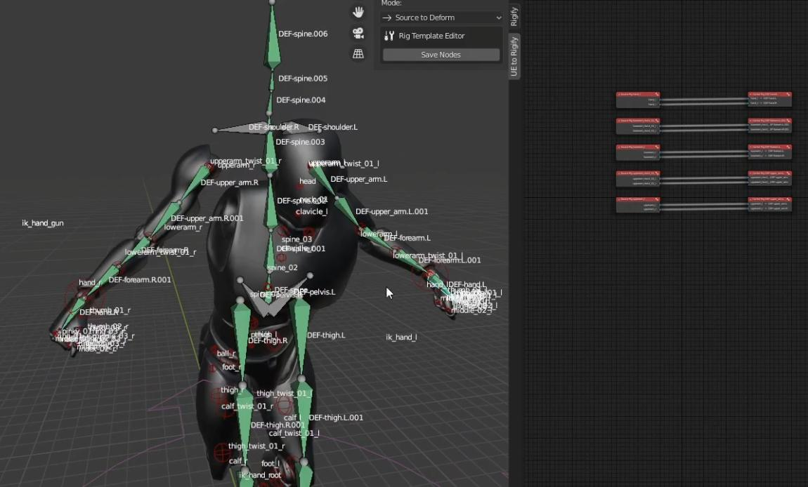
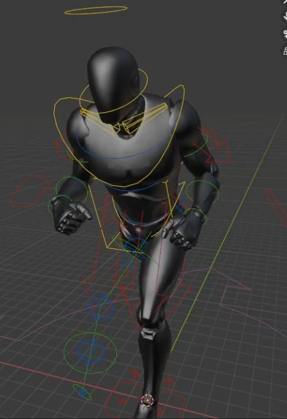

# New Template Example

<iframe src="https://www.youtube.com/embed/F9cTXzO8wq0" frameborder="0" allow="accelerometer; autoplay; clipboard-write; encrypted-media; gyroscope; picture-in-picture" allowfullscreen style="position: absolute; top: 0; left: 0; width: 100%; height: 100%;"></iframe>

Now that we understand a bit about templates and modes, let's walk through creating our own template.

So the first thing you need to do when you want to create a new template is go over here to the templates drop down,
then select `create new`.

I'm just going to select the basic human as my starter template, and call this new template `Demo`.

I'm going to click `Save Metarig` and then I'll click `Convert` to switch to control mode. Here you can see our Rigify
rig, but nothing is attached and the bones aren't in the right positions.

To fix this lets switch to ‘Edit Metarig’ mode.  What we need to do is remove the bones that we don't need and set the
others in the correct position. X-axis mirroring and vertex snapping is automatically turned on to make this easier.

Now I will set my bones to the correct positions(I am just doing the arms for the sake of this demo).

I'm gonna go ahead and switch over to ‘FK to Source’ mode. When I'm in this mode, I can start constraining the Rigify
FK bones to the "Source" bones.  I can do this by selecting the two bones that need to be linked and hit Alt+1 in the
3D viewport and select "Link Selected Bones".

This creates these two nodes in the node tree of the `Bone Remapping Nodes` view.

By using the X-axis mirroring feature and the correct custom bone name tokens for the left and right values, we can
constrain both arms simultaneously.

We will do the same thing in `Source to Deform` mode.

Now if I switch to ‘Control’ mode, you can see that we have our arms and their animation copied over. You can see
that are rig doesn't match up entirely because we only did the arms. But it's the exact same process to map the rest
of the skeleton.

We can even go back to metarig mode and change the Rigify bone types from `limbs.super_limb` to `limbs.simple_tenticle`
and adjust the mappings to switch the arm chain to a tentacle chain.

Now you can see the tentacle controls in `Control` mode.

Transferring root motion is also possible by using the source rig object node. A link can be made between it and the
desired bone in `FK to Source` mode and `Source to Deform` mode. The source rig object node can be added to the node
tree by hitting:

`SHIFT+A > Object > Source Rig Object`

This is essentially the process that you have to go through to create your own templates for your own unique rigs.
