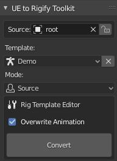
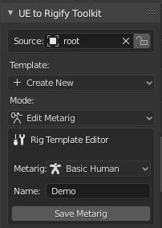
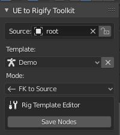
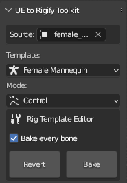

# UE to Rigify Panel
This section defines all the properties and operators depicted below in the ‘UE to Rigify’ panel in the 3D viewport.

### Source

This object picker specifies which object is the ‘Source’ rig.

### Template

This dropdown allows you to select a template or create a new one. New templates are stored within:
- windows: `%TEMP%\ue2rigify\resources\rig_templates`
- unix: `/tmp/ue2rigify/resources/rig_templates`

### Mode

This dropdown allows you to select which mode you want to edit your rig template in. The ‘UE to Rigify’ modes are: ‘Source’, ‘Edit Metarig’, ‘FK to Source’, ‘Source to Deform’, and ‘Control’.

### Overwrite Animation

If enabled, your control rig animation data will be overwritten by the animation data from your source rig.

### Metarig

This dropdown gives you some metarig presets that you can use as starting points when creating your new metarig template.

### Name

This property defines the name of your new rig template.

### Save Metarig

This operator saves the state of your current metarig into the rig template file, and switches the mode back to ‘Source’ mode.

### Save Nodes

This operator saves the state of your current node tree into the rig template file, and switches the mode back to ‘Source’ mode.

### Convert

This operator switches the current mode to ‘Control’ mode, builds the Rigify rig, and constrains the ‘Source’ rig bones to it.

### Revert

This operator switches the current mode to ‘Source’ mode, and restores the view to just the ‘Source’ rig.

### Bake

This operator bakes the ‘Control’ rig actions to the ‘Source’ rig actions.

### Bake every bone

If enabled, this will bake every bone on the source rig. If not enabled, it will only bake the source rig bones
that are linked to the control rig's FK bones in the FK to Source template.
